# Hungry Chippos — 8-bit SAR ADC (SSCS Chipathon 2026)

An 8-bit successive-approximation-register ADC in **GlobalFoundries 180 nm (gf180mcuD, variant D / 5LM)**, designed end-to-end with open-source tools (Xschem, ngspice, KLayout, Magic) for the [IEEE SSCS Chipathon 2026](https://github.com/sscs-ose/sscs-chipathon-2026). The signed-off chip block is **DRC-clean, LVS-clean, and tapeout-ready**.

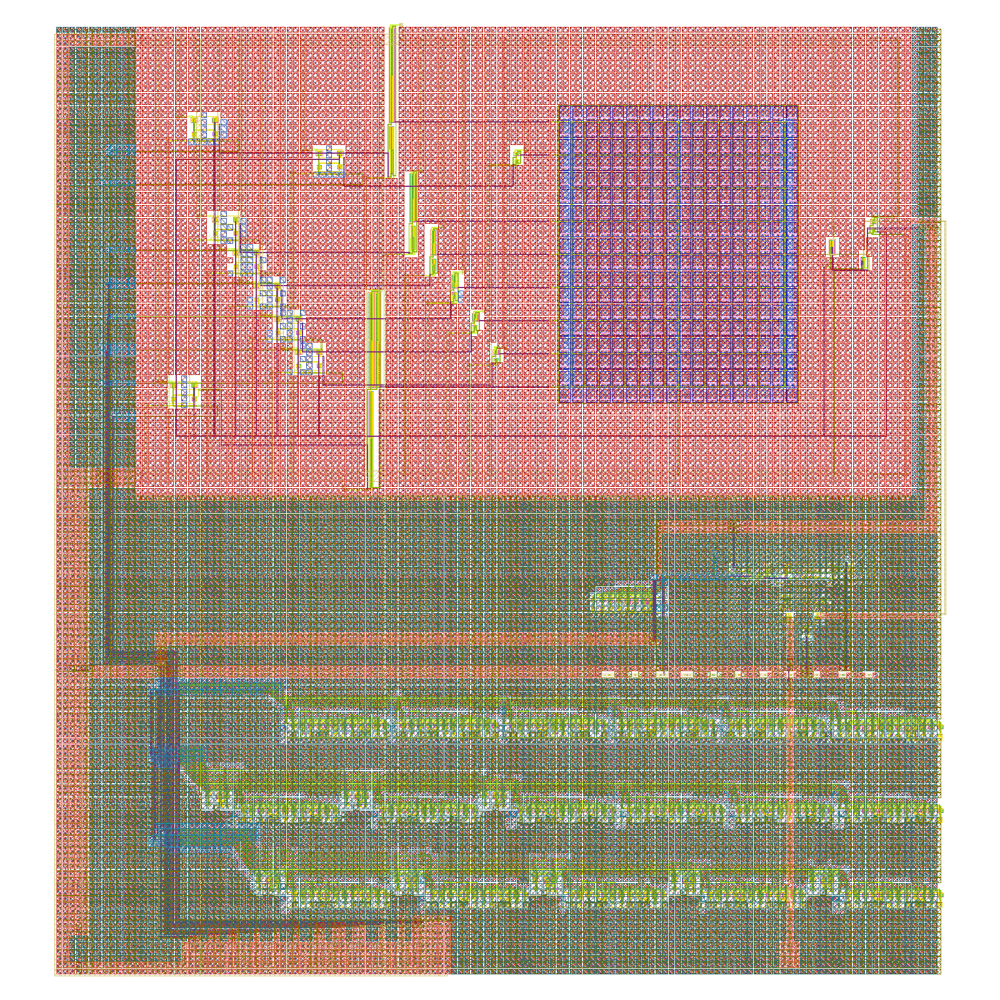
*`adc_top` chip block — 514.25 × 549.7 µm. Cap-DAC MiM array (top right), comparator + glue (center), 3-row folded SAR logic (bottom).*

## Headline numbers

| Spec | Value |
| :--- | :--- |
| Resolution | 8 bits |
| Sample rate | 833 kS/s @ 10 MHz CLK (12 CLK/conversion) |
| ENOB / SNDR | 7.20 bits / 45.3 dB (static-transfer-projected) |
| Quoted input range | 0.70 – 3.25 V (holds across VDD ±10 %, −40…125 °C, all MOS corners incl. SS × −40 °C) |
| Linearity | Monotonic, no missing codes, all MOS corners |
| Supply | Single 3.3 V (VDD doubles as the DAC reference) |
| Block area | 514.25 × 549.7 µm (padring proposal Block B) |
| Sign-off | DRC **0/660**, LVS **862/862 “Netlists match”**, density + antenna clean |

All numbers are simulation-verified; see the [Progress Tracker](PROGRESS.md) and [Reproducibility guide](REPRODUCIBILITY.md) for the exact runs.

## Team

| Team Member | Role | GitHub | Affiliation |
| :--- | :--- | :--- | :--- |
| Bruno | Top-level Integration & Comparator | [@brubru6707](https://github.com/brubru6707) | Brown University (2nd Year) |
| Max | DAC / Cap Array | @Maxwell | Brown University (2nd Year) |
| Sam | SAR Logic | [@sam581](https://github.com/sam581) | Brown University (2nd Year) |
| Emily | Layout / Verification | — | Brown University (2nd Year) |
| Mimi | Switch | — | Brown University (2nd Year) |
| Luc | Alternative Comparator Design | — | Brown University (3rd Year) |

**Per-block scoreboard** (each block individually signed off before chip assembly):

| Block | Owner | LVS devices | DRC | Notes |
| :--- | :--- | :--- | :--- | :--- |
| Cap-DAC (255 Cu + switches) | Max | 377/377 | 0/660 | 8-bit binary-weighted charge redistribution, MiM option B |
| SAR logic | Sam | 458/458 | 0/660 | 1220 × 46 µm strip, folded into 3 rows for the chip slot |
| StrongARM comparator | Bruno | 11 devices | 0/660 | MC offset characterized (see below) |
| Glue (CK/SAMPLE inverters + SR latch) | Bruno | 16/16 | 0/660 | 6 gates |
| **Chip top `adc_top`** | Bruno / Emily | **862/862** | **0/660** | + density & antenna clean |

## Architecture

VIN drives the comparator directly; the cap-DAC runs as a VDAC generator that walks toward VIN under SAR control (scheme in [docs/pin_contracts.md](docs/pin_contracts.md)). The comparator decision is buffered through matched inverters into a cross-coupled NOR SR latch — deliberately *not* a NAND latch, whose asymmetric Miller loading was found (INT-5) to bias near-rail decisions.

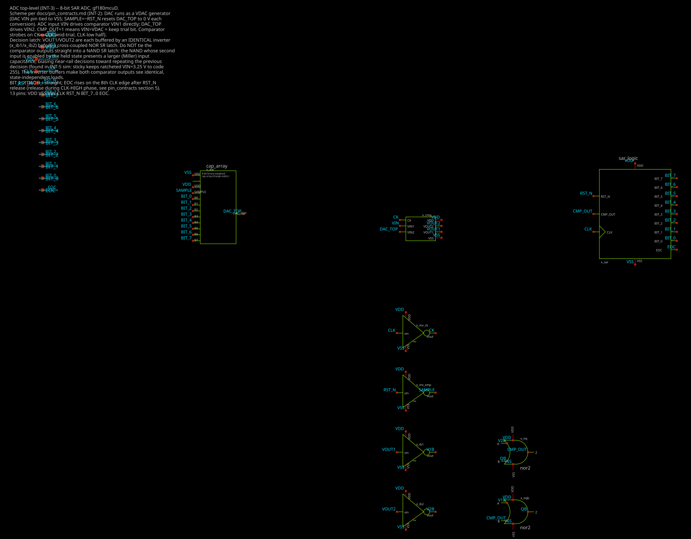
*Top level: cap-DAC, clocked comparator, decision latch, and SAR controller.*

<table>
<tr>
<td width="50%">

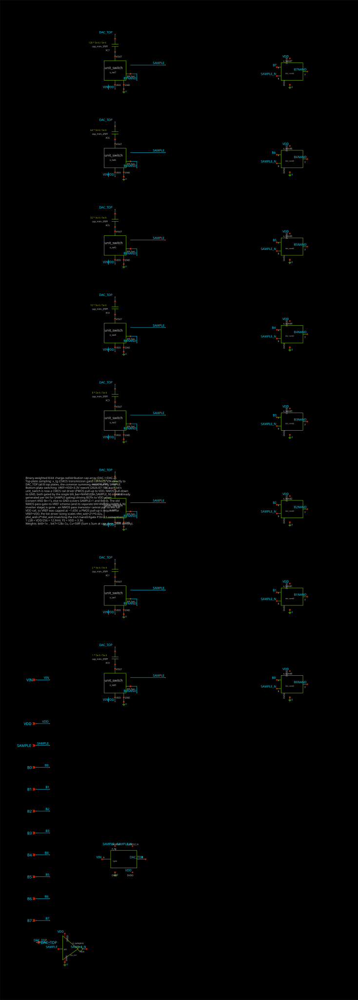
*Cap-DAC: one of 8 binary-weighted bit slices (unit switch + MiM caps + NAND drive).*

</td>
<td width="50%">

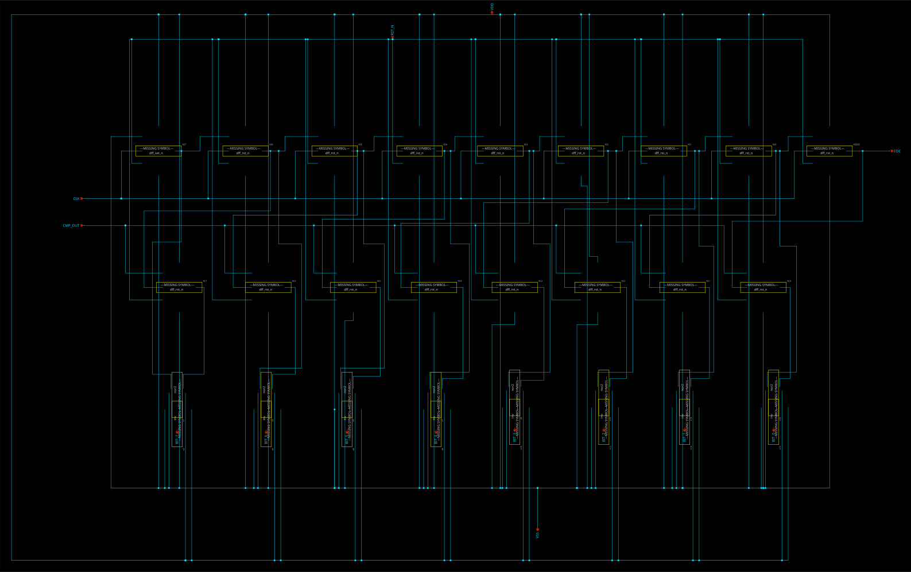
*SAR controller: DFF-based sequencer + bit register, 458 devices.*

</td>
</tr>
<tr>
<td>

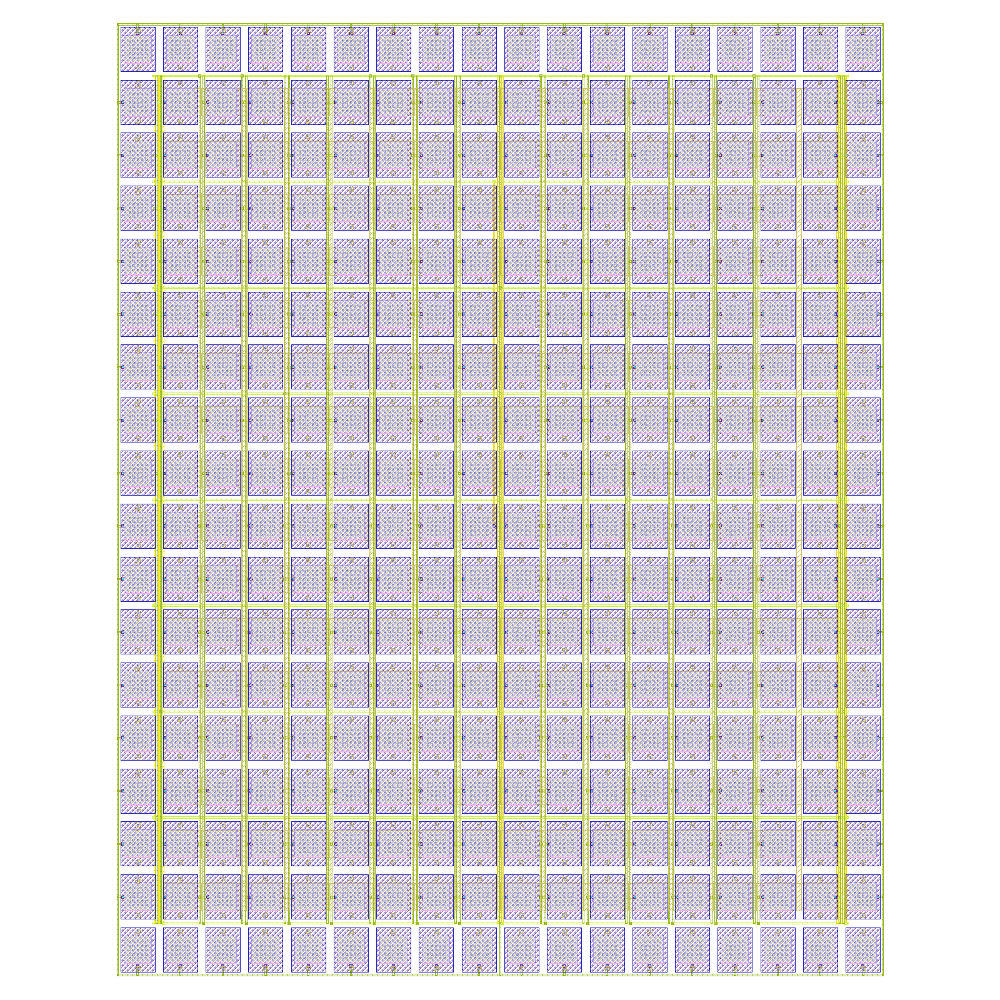
*Cap-DAC layout (MiM cap array + switch/driver row).*

</td>
<td>

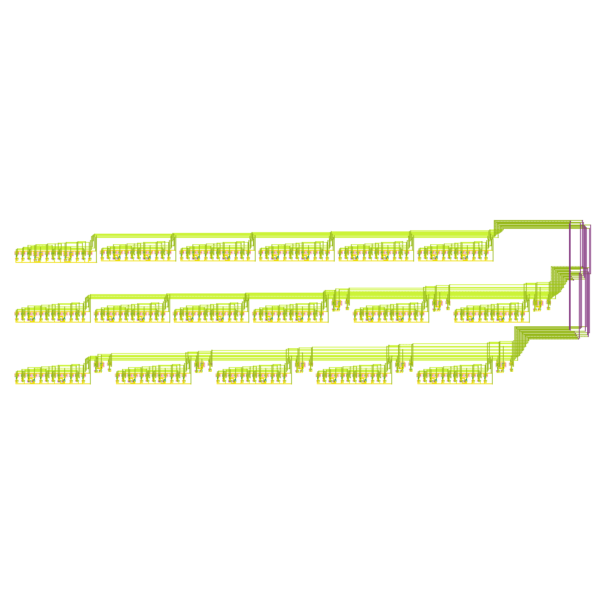
*SAR logic strip layout (shown unfolded).*

</td>
</tr>
</table>

## Two comparators, two full integrations

The chip has **two fully-integrated ADC variants**, differing only in the comparator:

- **Variant A — `adc_top`** (taped-out block): Bruno's single-stage **StrongARM latch**. This is the laid-out, signed-off configuration.
- **Variant B — `adc_top_alt`** (schematic/simulation level): Luc's **two-stage comparator** — a dynamic preamp in front of a StrongARM latch — dropped into the *same* DAC, SAR, and glue. Netlist: [`adc_top/sim/adc_top_alt_subckt.spice`](adc_top/sim/adc_top_alt_subckt.spice), testbench: [`tb_adc_top_alt.spice`](adc_top/sim/tb_adc_top_alt.spice).

Integration details for Variant B (2026-08-05):

- The latch clock **CKL** is generated on-chip from CK by a 2-inverter delay chain with 20 fF loads, measured **0.70 ns** at TT ([`tb_ckl_delay.spice`](adc_top/sim/tb_ckl_delay.spice)) — inside the 0.6–1.0 ns survival window from Luc's COMP-ALT-10 corner study. (1.7 ns was tried first and the latch fails exactly as the window predicts.)
- The two-stage comparator's decision polarity at the same input pins is **opposite** to the bare StrongARM's, so VIN/DAC_TOP are swapped at its inputs to restore the SAR loop convention.

**Closed-loop conversion results** (5 conversions, TT, 3.3 V, 10 MHz — same stimulus for both variants):

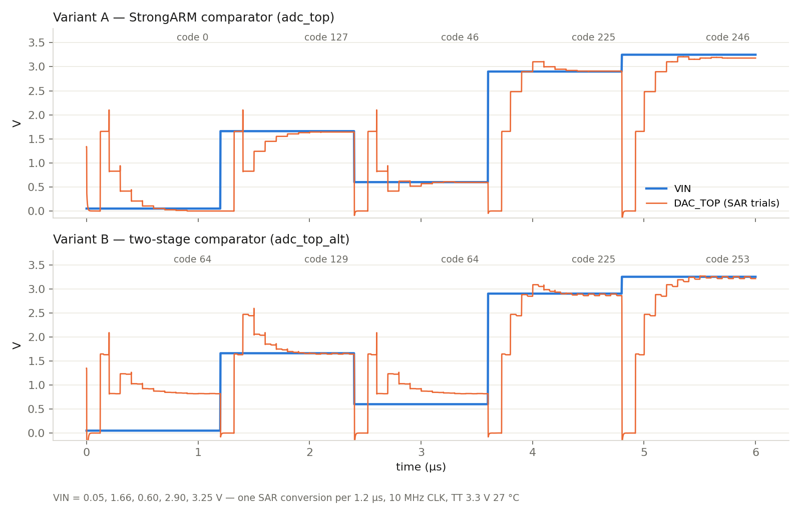

| VIN (V) | Ideal code | Variant A (StrongARM) | Variant B (two-stage) |
| :--- | :--- | :--- | :--- |
| 1.66 | 128 | 127 (−1) | 129 (+1) |
| 2.90 | 224 | 225 (+1) | 225 (+1) |
| 3.25 | 252 | 246 (−6) | 253 (+1) |
| 0.60 | 46 | 46 (0) | 64 (saturates) |
| 0.05 | 3 | 0 (clips) | 64 (saturates) |

The comparison matches each design's physics: Luc's nfet-input dynamic preamp is **tighter at the top of the range** (+1 LSB at 3.25 V where the bare StrongARM drops 6 LSB) but raises the usable low end to ≈0.8 V, while Variant A holds accuracy further down. Its preamp input pair also adds ≈300 fF on DAC_TOP (≈1.3 % DAC attenuation → the consistent +1 LSB). In-range codes for Variant B are within ±1 LSB.

<table>
<tr>
<td width="50%">

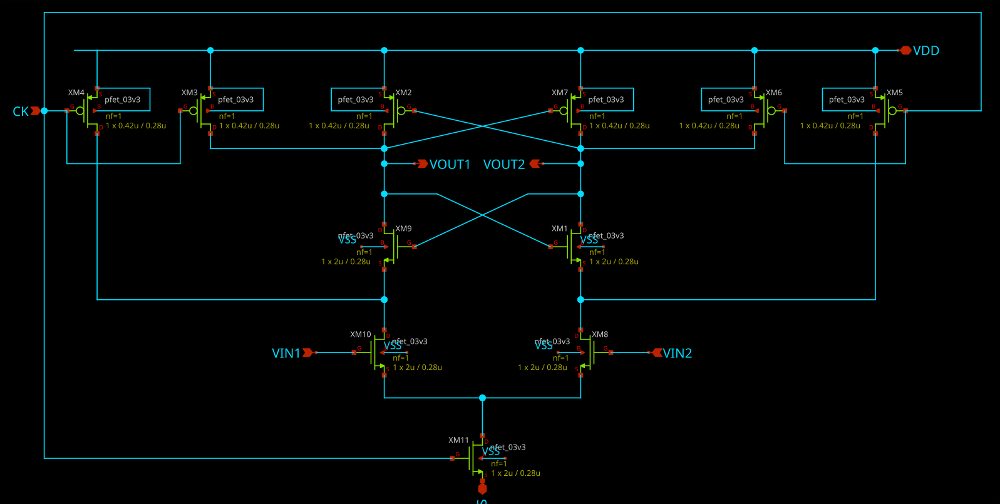
*Variant A: StrongARM latch (COMP-10 netlist).*

</td>
<td width="50%">

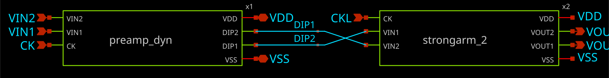
*Variant B: dynamic preamp → StrongARM-2 latch.*

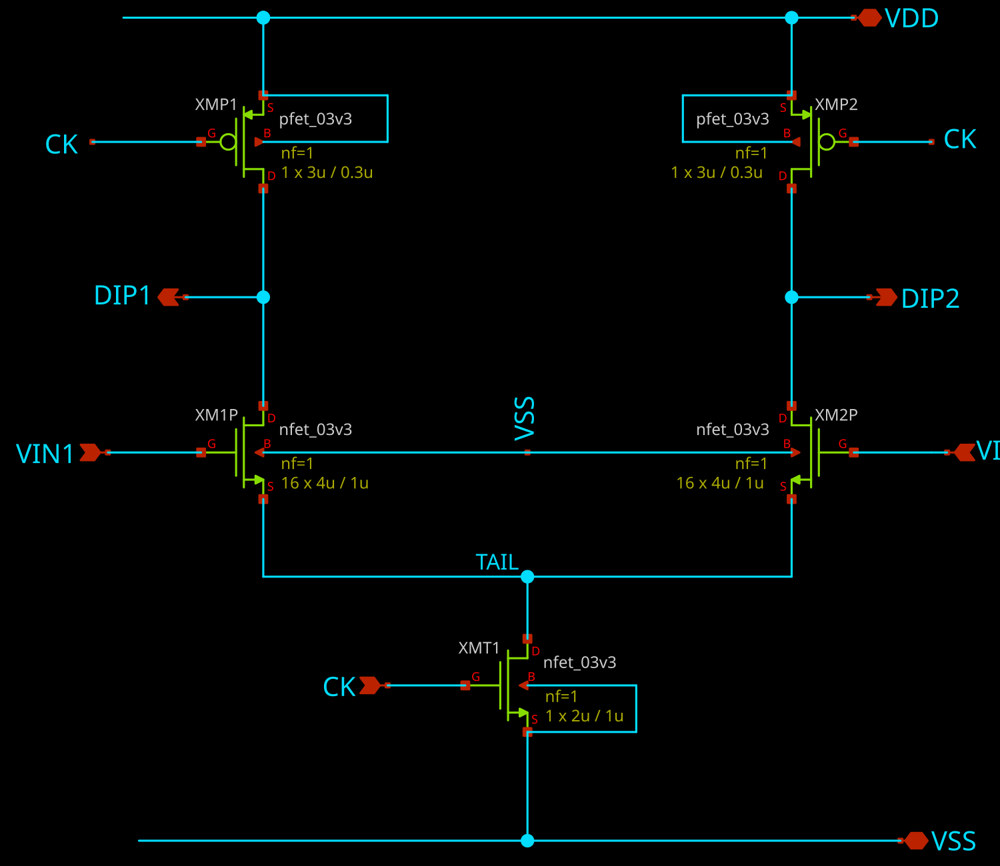
*Preamp stage (M = 16 input pair, 64 µm² per device).*

</td>
</tr>
<tr>
<td>

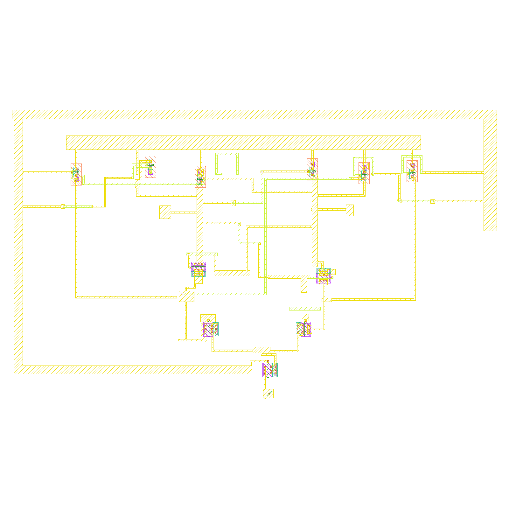
*StrongARM layout. Offset MC (N=100): σ = 36.9 mV — [report](comparator/comp_mc_report.txt); the SAR loop tolerates this as a code offset, not a linearity error.*

</td>
<td>

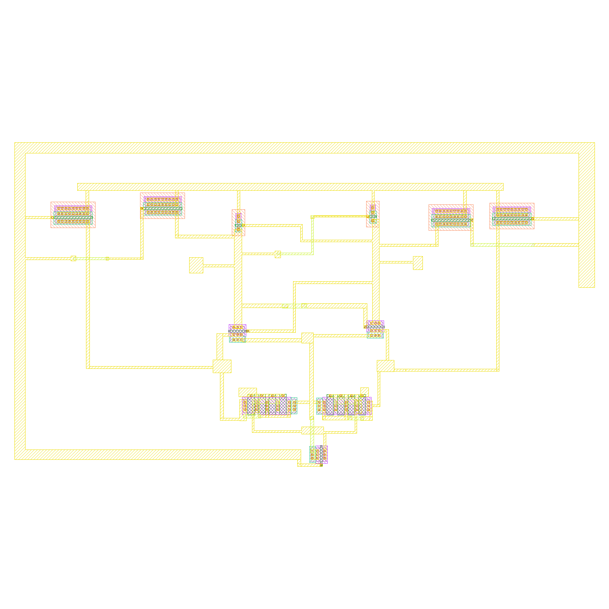
*StrongARM-2 latch layout. Offset MC (N=100, CKL=2.8 ns): σ = 1.09 mV — [report](comparator_alt/results/mc_ckl2p8_n100_report.txt).*

</td>
</tr>
</table>

## Chipathon links

| | |
| :--- | :--- |
| Team issue | [sscs-chipathon-2026#18](https://github.com/sscs-ose/sscs-chipathon-2026/issues/18) |
| Progress tracker | [PROGRESS.md](PROGRESS.md) |
| Reproducibility | [REPRODUCIBILITY.md](REPRODUCIBILITY.md) |
| Proposal | [Google Doc](https://docs.google.com/document/d/1fKD_CIMakMogI1Ux0onroEAOE0f9v6Mbu71VdGIJpjI/edit?usp=sharing) |
| Proposal slides / video | [Slides](https://docs.google.com/presentation/d/1YiHz-10-ayeriHM-xqGJkT-SbB14Z78Zl8ZGlZeix68/edit?usp=sharing) · [Video](https://youtube.com/watch?v=9x7Wc1Ou2T4&feature=youtu.be) |
| Schematic review slides / video | [Slides](https://docs.google.com/presentation/d/16MQY0RTOPxoqBUxwLf6Rn5_GblbKmeqlZLEJHqbb0rs/edit?usp=sharing) · [Video](https://youtu.be/x1xBCsqazME?si=QPp0k89b8nxFMOwx) |
| Signed-off GDS | [`adc_top/layout/adc_chip_top.gds`](adc_top/layout/adc_chip_top.gds) (topcell `adc_top`) |

## Tapeout submission files

Per the dry-run instructions, the repo root carries:

- [`info.yaml`](info.yaml) — top block (`adc_top`), GDS path, area, and the 14-pin list (1 power, 1 ground, 11 digital, 1 analog) for padring Block B
- [`lvs_config.json`](lvs_config.json) — top source/layout cell and LVS source netlist ([cf-precheck format](https://github.com/chipfoundry/cf-precheck/blob/main/src/cf_precheck/be_checks/README.md))

## Repository map

```
adc_top/         chip-top schematic, signed-off GDS, DRC/LVS runs, integration sims
                 (incl. adc_top_alt_* — the Variant B integration)
dac/             cap-DAC schematics + layout (variant D standing rule: 5LM, MiM option B)
sar_logic/       SAR controller schematics, layout generator, sims
comparator/      StrongARM comparator (Variant A) + MC offset study
comparator_alt/  Luc's two-stage comparator (Variant B) + CKL window study
input_sampling/  sampling switch work
docs/            pin contracts, workflows, images (docs/img/)
designs/         xschem libraries / container-mounted work area
```

## Development environment

The project uses the [IIC-OSIC-TOOLS](https://github.com/iic-jku/IIC-OSIC-TOOLS) Docker container (preconfigured gf180mcuD PDK). Quick start:

```bash
./start_chipathon_vnc.sh     # macOS/Linux   (Windows: .\start_chipathon_vnc.bat)
# VNC to localhost:5901 (or browse http://localhost), password abc123
```

The repo is mounted at `/foss/designs` inside the container. Team branching/PR conventions are in [docs/team_workflow.md](docs/team_workflow.md); layout workflow in [docs/layout_workflow.md](docs/layout_workflow.md); troubleshooting in [docs/troubleshooting.md](docs/troubleshooting.md). Layout/schematic images in `docs/img/` are regenerated headlessly — see [`docs/img/render_gds.py`](docs/img/render_gds.py).

## License

MIT — see [LICENSE](LICENSE).
